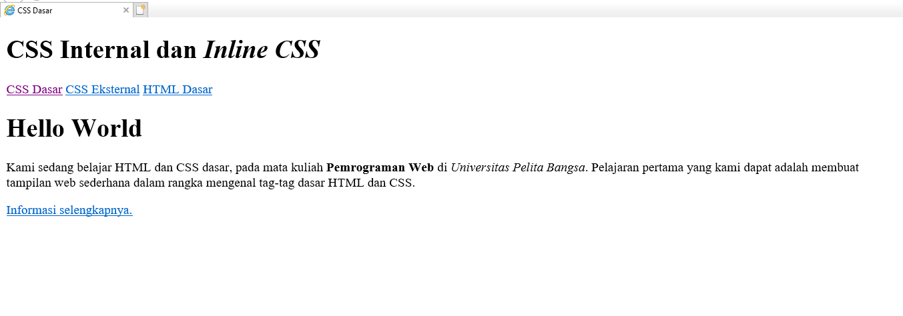
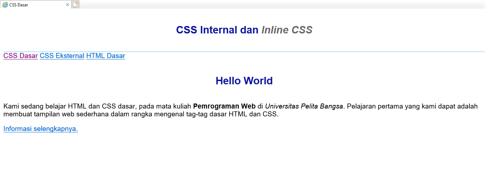
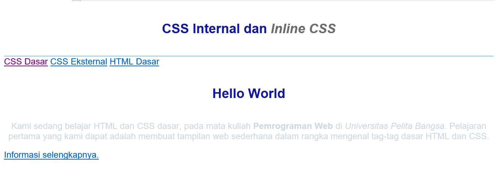
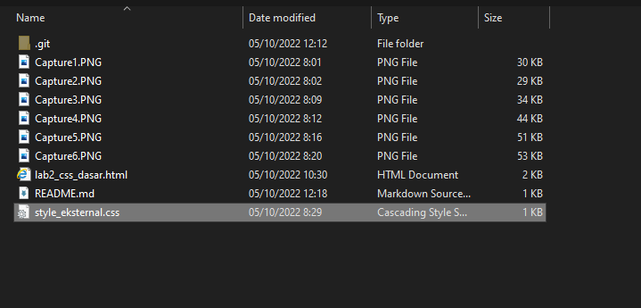
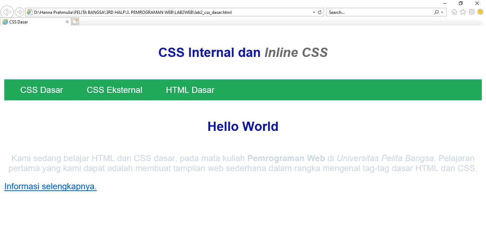
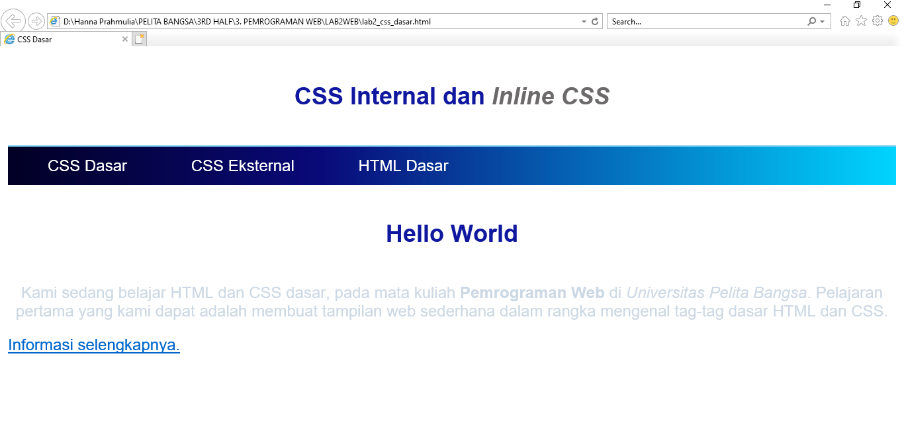
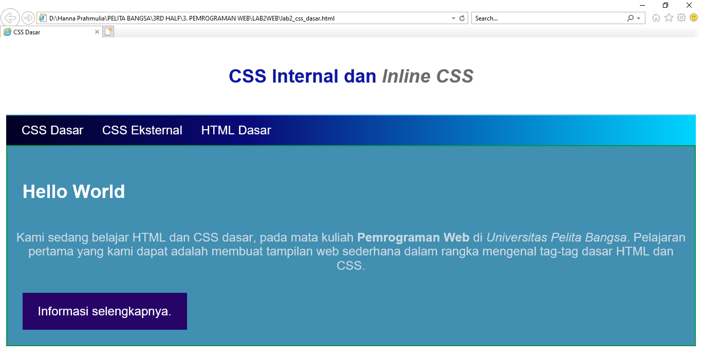
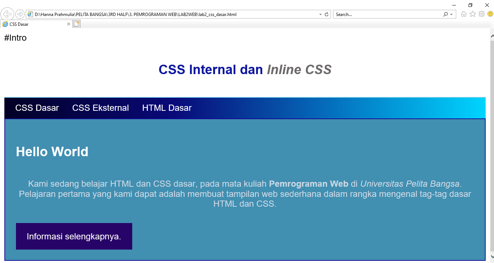

# Lab2Web
this is my 2nd practicum assignment for the WEB Programming course

Pertanyaan dan Tugas 

 <i> 1. Lakukan eksperimen dengan mengubah dan menambah properti dan nilai pada kode CSS 
dengan mengacu pada CSS Cheat Sheet yang diberikan pada file terpisah dari modul ini </i> 

### Membuat dokumen HTML

### Mendeklarasikan CSS Internal

### Menambahkan Inline CSS

### Membuat CSS Eksterna
 

###  Menambahkan CSS Selector

 <i> 2. Apa perbedaan pendeklarasian CSS elemen h1 {...} dengan #intro h1 {...}? berikan 
penjelasannya! </i> 

 Elemen h1 {,,} fungsinya untuk memberikan style yang berbeda pada sebuah elemen.

  

 #intro h1 {,,}  untuk menyeleksi element yang memiliki attribute ID dengan value "intro" 
 
  

 <i> 3. apabila ada deklarasi CSS secara internal, lalu ditambahkan CSS eksternal dan inline CSS pada 
elemen yang sama. Deklarasi manakah yang akan ditampilkan pada browser? Berikan penjelasan dan contohnya ! </i> 

 Pada dasarnya sesuai kebutuhan semua perubahan akan tampil pada browser, ada beberapa kode yang bisa di lakukan internal dan inline, hanya saja yang membuuat halaman atau tampilan web maximal dan sesuai keinginan, makan kita deklarasikan semua design yang kita inginkan pada CSS Eksternal,,karena ada beberapa kode/ design tampilan yang tidak bisa di lakukan di internal HTML dan inline CSS

 Berikut adalah tampilan jika saya melakukan secara internal

 Berikut adalah tampilan jika saya melakukan secara Eksternal

  

 <i> 4.  pada sebuah elemen HTML terdapat ID dan Class, apabila masing-masing selector tersebut 
terdapat deklarasi CSS, maka deklarasi manakah yang akan ditampilkan pada browser? 
Berikan penjelasan dan contohnya! </i> 

 yang akan tampil pada browser adalah keduanya,,,

